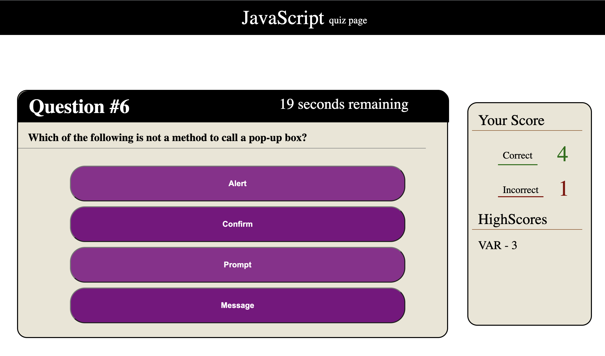

# timed-javascript-quiz-app

|   Languages   | Used |
| ----------- | ----------- |
| HTML     |    ✅    |
| CSS  |    ✅     |
| JavaScript  |    ✅    |

## Description

This project was about using javascript to create an interactive quiz that would present new questions, initiate a timer, keep track of correct and incorrect answers, and store the user's score and initials. I used functions to define data-labels on the answer buttons, allowing each question to set the button with the correct answer. This information was called upon to keep count of the user's correct and incorrect answers. At the end of the quiz, the user is presented with a form that will append their initials and number of correct answers to a highscores list. 

### Pseudocode

1. When the user clicks the 'Begin' button, the function that begins the question prompt will be called
    - Upon starting, a timer is set to count down from 50 seconds
2. The user is then prompted with the first question, along with a list of buttons that provide a multiple choice list of answers for the user to select from
    - if the user selects correctly, their correct score is incremented
    - if they select incorrectly, their incorrect score is incremented and 10 seconds are removed from the timer
3. The quiz is over when either the user answers all questions or the timer runs out
4. a form will be presented to the user to record their initials, and their initials and score will be appended to the 'highscores' list

---

### Gameplay snapshot

---

#### Usage

Click <a href="https://jkwalsh127.github.io/timed-javascript-quiz-app/">**here**</a> to check out the deployed quiz!

#### Credits

Staff at UC Berkeley Extension full-stack coding bootcamp

