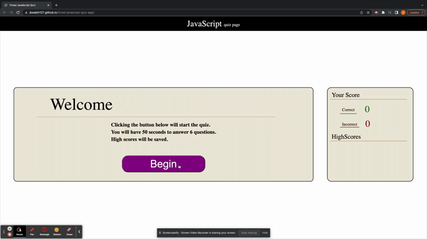

# Timed Javescript Quiz

## Usage

Click <a href="https://jkwalsh127.github.io/timed-javascript-quiz-app/">**here**</a> to check out the deployed quiz!

## Description

This project was about using javascript to create an interactive quiz that would present new questions, initiate a timer, keep track of correct and incorrect answers, and store the user's score and initials. I used functions to define data-labels on the answer buttons, allowing each question to set the button with it's corresponding correct answer. This information was called upon to keep count of the user's correct and incorrect answers. At the end of the quiz, the user is presented with a form for them to enter their initials. The submission of the form will first append their initials and number of correct answers to a highscores list, and then return the user to the landing page where they can select to take the quiz again.

### Pseudocode

1. The landing page will display a welcome card, along with the scoreboard. When the user clicks the 'Begin' button, the function that begins the question prompt will be called, and the welcome card will be replaced with the questions card
    - Upon starting, a timer is set to count down from 50 seconds
2. The user is then prompted with the first question, along with a list of buttons that provide a multiple choice list of answers for the user to select from. Each question is its own function that sets the prompt along with the answers and the correct/incorrect state for each button
    - if the user selects correctly, their correct score is incremented
    - if they select incorrectly, their incorrect score is incremented and 10 seconds are removed from the timer
3. The quiz is over when either the user answers all questions or the timer runs out
4. The card that holds the questions will be replaced with an 'after-action' card that outputs the user's final number of correct answers along with the form for their initials.
5. Upon submitting the form, the user's score and initials will be appended to the highscores list, and the after-action card will be replaced with the welcome card

### Gameplay preview

### Collaborators

Just myself! Get in touch with me:

email: jkwalsh127@gmail.com

linkedIn: https://www.linkedin.com/in/jake--walsh/

my portfolio page: https://jkwalsh127.github.io/my-portfolio-page/

#### Credits

Staff at UC Berkeley Extension full-stack coding bootcamp

#### Liscense 

MIT

Permission is hereby granted, free of charge, to any person obtaining
a copy of this software and associated documentation files (the
"Software"), to deal in the Software without restriction, including
without limitation the rights to use, copy, modify, merge, publish,
distribute, sublicense, and/or sell copies of the Software, and to
permit persons to whom the Software is furnished to do so, subject to
the following conditions:

The above copyright notice and this permission notice shall be
included in all copies or substantial portions of the Software.

THE SOFTWARE IS PROVIDED "AS IS", WITHOUT WARRANTY OF ANY KIND,
EXPRESS OR IMPLIED, INCLUDING BUT NOT LIMITED TO THE WARRANTIES OF
MERCHANTABILITY, FITNESS FOR A PARTICULAR PURPOSE AND
NONINFRINGEMENT. IN NO EVENT SHALL THE AUTHORS OR COPYRIGHT HOLDERS BE
LIABLE FOR ANY CLAIM, DAMAGES OR OTHER LIABILITY, WHETHER IN AN ACTION
OF CONTRACT, TORT OR OTHERWISE, ARISING FROM, OUT OF OR IN CONNECTION
WITH THE SOFTWARE OR THE USE OR OTHER DEALINGS IN THE SOFTWARE.
